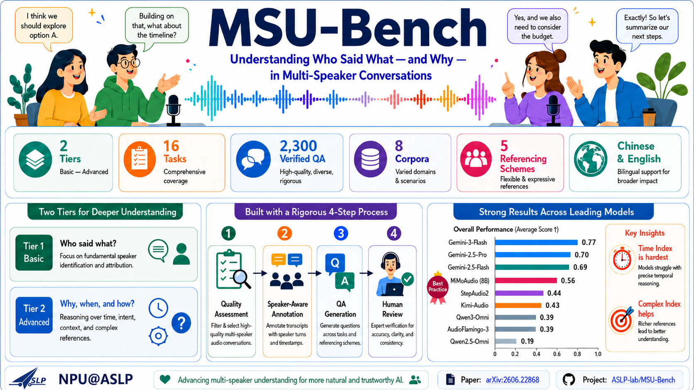
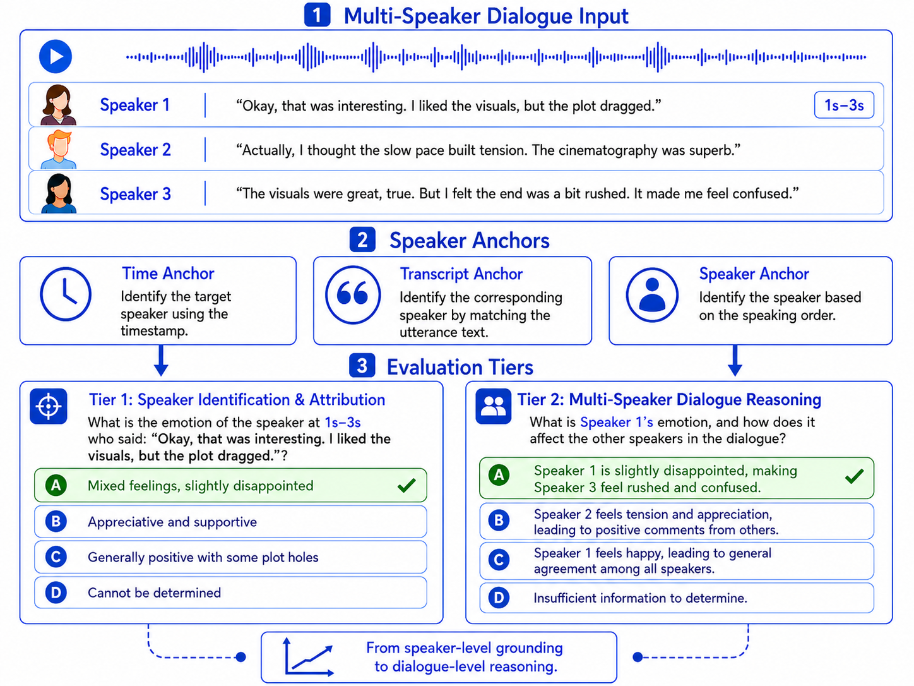
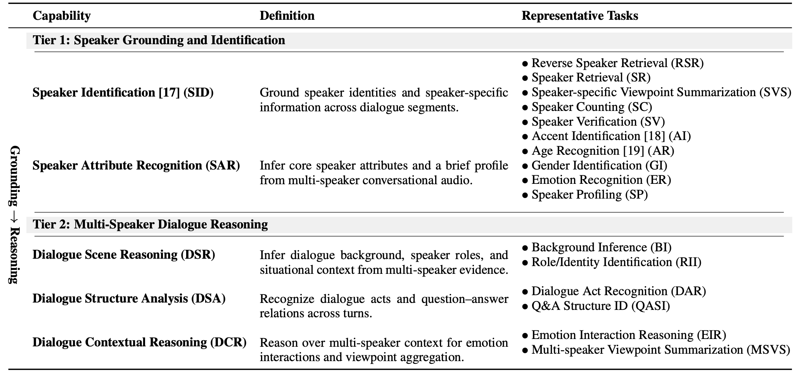
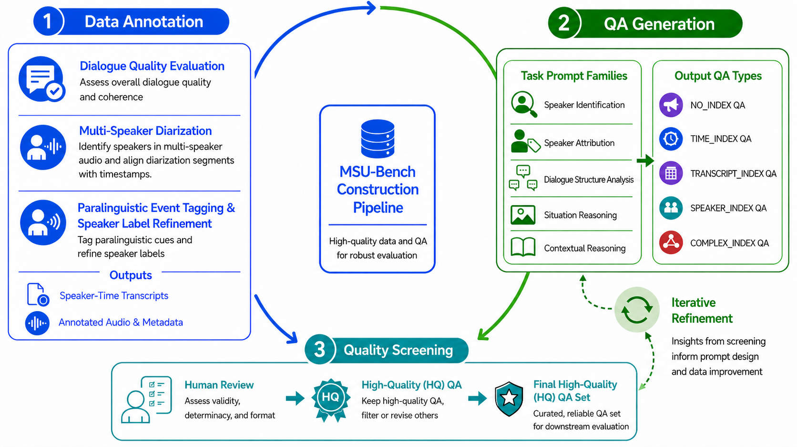
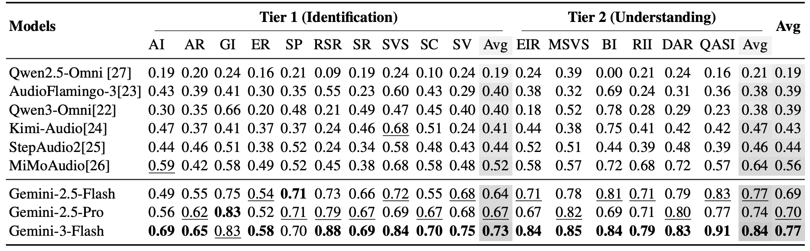

<div align="center">

# Interspeech 2026: MSU-Bench

*A diagnostic benchmark for evaluating how well Large Audio-Language Models (LALMs) understand **who says what**, and **what happens between speakers**, in real multi-speaker conversations.*

[](https://aslp-lab.github.io/msu-bench.github.io/)
[](https://arxiv.org/abs/2606.22868)
[](https://huggingface.co/datasets/ASLP-lab/MSU-Benchmark)
[](LICENSE)
[](#license)

**Zhaokai Sun**\*, **Shuai Wang**\*, **Zhennan Lin**\*, Chengyou Wang, Dehui Gao, Yuang Cao, Chunjiang He, Pan Zhou, **Lei Xie**\*\*

Audio, Speech and Language Processing Group (**ASLP@NPU**), School of Software, **Northwestern Polytechnical University**, China
School of Intelligent Science and Technology, **Nanjing University**, China
**Shenzhen Loop Area Institute**, China
Base Model, **Li Auto**, China

<sub>\* Equal contribution &nbsp;·&nbsp; \*\* Corresponding author &nbsp;·&nbsp; 📮 `zksun@mail.nwpu.edu.cn`</sub>



</div>

---

## 📢 News

- **2026-07-07** &nbsp;·&nbsp; QA construction pipeline open-sourced (see [`bench_generation_pipeline/`](bench_generation_pipeline/)).
- **2026-07-04** &nbsp;·&nbsp; Dataset released on 🤗 [`ASLP-lab/MSU-Benchmark`](https://huggingface.co/datasets/ASLP-lab/MSU-Benchmark).
- **2026-06-04** &nbsp;·&nbsp; MSU-Bench is accepted at **Interspeech 2026**.

---

## Overview

Spoken Language Understanding is moving from task-specific pipelines toward **Large Audio-Language Models (LALMs)** that generate natural-language responses over speech. Yet existing speech benchmarks still focus on **single-speaker** audio or isolated subtasks (ASR, speaker verification, emotion recognition, …), leaving **speaker-centric understanding in real multi-speaker conversations** insufficiently evaluated — real conversations involve rapid turn switching, overlaps, interruptions, and speaker-dependent variations in style, emotion, and intent.

> **Who is speaking? · Whose viewpoint is this? · What is the relationship between speakers? · How do their emotions and stances evolve across turns?**

**MSU-Bench** is a diagnostic benchmark built around these questions — a **5M design** (*multi-tier · multi-speaker · multilingual · multi-scenario · multi-task*) organized as a **two-tier** framework of **5 capabilities** and **16 tasks**, with **2,300 human-verified multiple-choice QA instances** sampled from **~731 hours** of Chinese/English telephone, meeting, podcast, and film/TV audio. Diagnostically-designed distractors let us pinpoint *why* a model fails: wrong-speaker attribution, hallucination, or incorrect "unknown" answers.

- 🌐 **Demo:** https://aslp-lab.github.io/msu-bench.github.io/
- 📄 **Paper (arXiv):** https://arxiv.org/abs/2606.22868
- 🤗 **Dataset:** https://huggingface.co/datasets/ASLP-lab/MSU-Benchmark
- 💻 **Code:** https://github.com/ASLP-lab/MSU-Bench

<div align="center">

<br/>
<em>Figure 1. Two-tier task hierarchy of MSU-Bench, from speaker grounding to multi-speaker reasoning.</em>
</div>

---

## Task Taxonomy

MSU-Bench uses a two-tier design that progresses from basic speaker grounding to complex multi-speaker reasoning. It covers **5 capabilities** and **16 representative tasks**.

<div align="center">

<br/>
<em>Figure 2. Capability definitions and representative tasks in MSU-Bench.</em>
</div>

### Tier 1 — Speaker Grounding & Identification
Bind speech content, speaker identity, and speaker attributes together — *who is who, who said what, whose attribute is this*.

| Capability | Representative Tasks |
|---|---|
| **Speaker Identification (SID)** | Reverse Speaker Retrieval (RSR) · Speaker Retrieval (SR) · Speaker-specific Viewpoint Summarization (SVS) · Speaker Counting (SC) · Speaker Verification (SV) |
| **Speaker Attribute Recognition (SAR)** | Accent Identification (AI) · Age Recognition (AR) · Gender Identification (GI) · Emotion Recognition (ER) · Speaker Profiling (SP) |

### Tier 2 — Multi-Speaker Dialogue Reasoning
Reason about relationships, structure, and context across speakers — *what these utterances mean in the conversation*.

| Capability | Representative Tasks |
|---|---|
| **Dialogue Scene Reasoning (DSR)** | Background Inference (BI) · Role/Identity Identification (RII) |
| **Dialogue Structure Analysis (DSA)** | Dialogue Act Recognition (DAR) · Q&A Structure ID (QASI) |
| **Dialogue Contextual Reasoning (DCR)** | Emotion Interaction Reasoning (EIR) · Multi-speaker Viewpoint Summarization (MSVS) |

### Speaker-Referencing Schemes
To probe robustness to *how* a target speaker is specified — and to disentangle content-understanding errors from speaker-localization errors — each applicable task is instantiated under multiple referencing schemes:

| Scheme | Target speaker is specified by |
|---|---|
| **No Index** | A raw audio snippet of the target speaker (direct acoustic anchor) |
| **Time Index** | A time span (e.g. "the person speaking from 10s to 15s") |
| **Transcript Index** | A quoted transcript line |
| **Speaker Index** | Order of appearance (e.g. "the second speaker") |
| **Complex Index** | A combination of time / transcript / speaker cues |

This design lets us diagnose whether a failure comes from **content understanding**, **target-speaker localization**, or **higher-order cross-speaker reasoning**.

---

## Data & Construction Pipeline

### Data sources

MSU-Bench draws from **eight Chinese/English multi-speaker corpora**, spanning conversational and media-style audio, ~**731 hours in total**:

| Domain | Source | Duration |
|---|---|---:|
| Conversational | [Mandarin Chinese Telephony (MagicHub)](https://magichub.com/datasets/mandarin-chinese-conversational-speech-corpus-telephony/) | 5 h |
| Conversational | [English Telephony (MagicHub)](https://magichub.com/datasets/english-conversational-speech-corpus-telephony/) | 5 h |
| Conversational | AliMeeting | 12 h |
| Conversational | CHiME-6 | 12 h |
| Media-style | Wild English Podcast | 66 h |
| Media-style | Wild Chinese Podcast | 31 h |
| Media-style | Wild Chinese Movie | 400 h |
| Media-style | Wild English Movie | 200 h |

### Construction pipeline

<div align="center">

<br/>
<em>Figure 3. MSU-Bench construction pipeline: dialogue-quality assessment → speaker-aware annotation → speaker-referenced QA generation → human-in-the-loop quality control.</em>
</div>

1. **Dialogue-quality assessment** — Gemini scores candidate segments; only informative and coherent multi-speaker clips are kept. Audio is cut into short (1–2 min) and long (2–5 min) clips.
2. **Speaker-aware annotation** — the Volcano API produces speaker diarization and transcripts; Gemini annotates speaker identity, sound events, and paralinguistic cues.
3. **Speaker-referenced QA generation** — Gemini generates candidate QA from the raw audio + structured annotations + task-specific prompts, across all 16 tasks and 5 referencing schemes.
4. **Human-in-the-loop verification** — eight annotators with audio background verify metadata, revise ambiguous questions, check answer determinacy and format compliance, and remove invalid items.

### Quality assurance

| Metric | Tier 1 | Tier 2 |
|---|---:|---:|
| Initial QA validity (human-judged) | **95%** | **86%** |
| Human ↔ ground-truth answer agreement | **98%** | **96%** |

The full, reproducible pipeline is open-sourced under [`bench_generation_pipeline/`](bench_generation_pipeline/).

---

## Results

We evaluate **9 speech-language models** — 6 open-source (Qwen2.5-Omni, Qwen3-Omni, AudioFlamingo-3, Kimi-Audio, StepAudio2, MiMoAudio) and 3 closed-source Gemini systems (Gemini-2.5-Flash, Gemini-2.5-Pro, Gemini-3-Flash) — under a unified zero-shot A/B/C/D prompting protocol with exact-match accuracy.

### Overall accuracy by tier

| Model | Tier 1 (Identification) | Tier 2 (Understanding) | **Avg** |
|---|:---:|:---:|:---:|
| Qwen2.5-Omni | 0.19 | 0.21 | 0.19 |
| AudioFlamingo-3 | 0.40 | 0.38 | 0.39 |
| Qwen3-Omni | 0.40 | 0.38 | 0.39 |
| Kimi-Audio | 0.41 | 0.47 | 0.43 |
| StepAudio2 | 0.44 | 0.46 | 0.44 |
| **MiMoAudio** *(best open-source)* | 0.52 | 0.64 | **0.56** |
| Gemini-2.5-Flash | 0.64 | 0.77 | 0.69 |
| Gemini-2.5-Pro | 0.67 | 0.74 | 0.70 |
| **Gemini-3-Flash** *(best overall)* | **0.73** | **0.84** | **0.77** |

<div align="center">

<br/>
<em>Figure 4. Full per-task results across the 16 MSU-Bench tasks (see paper for details).</em>
</div>

### Accuracy under speaker-referencing schemes

| Model | Tier 1 (No / Time / Cpx) | Tier 2 (No / Time / Cpx) |
|---|:---:|:---:|
| Qwen3-Omni | 0.57 / 0.38 / 0.46 | 0.34 / 0.28 / 0.35 |
| MiMoAudio | 0.53 / 0.54 / 0.60 | 0.64 / 0.53 / 0.63 |
| **Gemini-3-Flash** | **0.71 / 0.64 / 0.84** | **0.83 / 0.76 / 0.92** |

### Diagnostic error-type composition

Error rates conditioned on incorrect answers — **WS** = wrong speaker, **HAL** = hallucination, **UNK** = unknown, **INS** = instruction-following failure.

| Model | Tier 1 (WS / HAL / UNK / INS) | Tier 2 (WS / HAL / UNK / INS) |
|---|:---:|:---:|
| Qwen3-Omni | 0.14 / 0.05 / **0.27** / 0.00 | 0.18 / 0.08 / **0.40** / 0.00 |
| MiMoAudio | **0.28** / 0.08 / 0.08 / 0.16 | **0.53** / 0.11 / 0.09 / 0.13 |
| Gemini-3-Flash | **0.30** / 0.07 / 0.05 / 0.13 | **0.67** / 0.11 / 0.03 / 0.06 |

### Key findings

- **Closed-source leads, but nobody solves it.** Gemini-3-Flash reaches **0.77** overall (Tier 1 0.73 / Tier 2 0.84). The best open-source model, MiMoAudio, reaches **0.56**. All models still struggle with complex speaker grounding and multi-speaker reasoning.
- **Time Index is the hardest referencing scheme.** Locating a target speaker from a time span remains a bottleneck under fast turn-taking and overlap; multi-cue *Complex Index* helps but exposes weak time↔identity alignment.
- **Strong models "blame the wrong speaker".** Weaker models default to *Unknown*, but as capability grows, errors shift toward **wrong-speaker attribution** — for Gemini-3-Flash, wrong-speaker choices account for **0.67** of its Tier-2 errors. This is a subtler and arguably more risky failure mode than answering "unknown".
- **General audio ability ≠ stable speaker-centric understanding.** Omni-style models do not automatically dominate; robust multi-speaker understanding needs dedicated speaker modeling, temporal alignment, and cross-speaker reasoning.

---

## Repository Structure

```
publish-github/
├── README.md                    # this file — project overview
├── docs/                        # 🌐 interactive demo site (GitHub Pages source)
│   ├── index.html               # single-page demo
│   ├── data.js / qa_data.js / bench_examples.js
│   ├── assets/images/           # figures used by the paper & this README
│   ├── video-example/           # annotated video clips
│   ├── annotations/             # speaker-segment annotations for the videos
│   ├── demo_qa/ demo_qa_audio/  # per-video QA + audio snippets
│   ├── bench_examples/          # 16-task gallery (CN + EN example per task, with audio)
│   └── .nojekyll
├── bench_generation_pipeline/   # 🔧 open-sourced QA construction pipeline
│   ├── 1_annotation_pipeline/   # audio → speaker/paralinguistic annotation
│   ├── 2_qa_generation/         # annotation → QA (per-capability prompts)
│   └── 3_samples/               # end-to-end CN & EN worked examples
└── bench_evaluation_pipeline/   # 📊 open-sourced model-evaluation pipeline
    ├── step1_prepare_data/      # HF download + CN/EN merge → language-tagged QA index
    ├── step2_run_scoring/       # per-QA scoring (Gemini 2.5 Flash by default; Doubao ref.)
    ├── step3_summarize_results/ # per-task / capability / tier / index-scheme /
    │                            # error-type / language CSVs
    ├── configs/                 # backend endpoint templates (.env.example)
    └── run_all.sh               # one-shot: prepare → score → summarize
```

---

## Quick Start

### View the demo online
The demo is served via **GitHub Pages** from the `docs/` folder:
👉 **https://aslp-lab.github.io/msu-bench.github.io/**

To enable Pages on your own fork: *Settings → Pages → Build from branch → `main` / `docs`*.

### Run the demo locally
```bash
cd docs
python3 -m http.server 8080
# then open http://localhost:8080
```

The demo includes:
- **Video + annotation explorer** — synchronized speaker segments with metadata (name, gender, age, emotion).
- **Interactive QA** — try questions under different speaker-referencing schemes, reveal answers.
- **16-task gallery** — one Chinese and one English example per task, each with reference audio and multiple QA variants.

### Reproduce the QA pipeline
See [`bench_generation_pipeline/README.md`](bench_generation_pipeline/README.md) for the full audio → annotation → QA flow, prompt templates, dependencies, and worked samples.

> ⚠️ **All API keys are anonymized to `YOUR_*` placeholders — fill in your own before running.** The pipeline uses Volcano ASR (diarization + transcripts) and Gemini (labeling + QA generation).

### Evaluate a model on MSU-Bench
See [`bench_evaluation_pipeline/README.md`](bench_evaluation_pipeline/README.md) for the end-to-end evaluation flow. Each stage is a self-contained script:

```bash
cd bench_evaluation_pipeline
cp configs/gemini.env.example configs/gemini.env  # then fill in secrets
bash run_all.sh
```

The default backend is **Gemini 2.5 Flash** (any `generateContent`-compatible endpoint works — swap `GEMINI_MODEL` for `gemini-2.5-pro` / `gemini-3-flash-preview` etc.); a Doubao-Seed reference backend is included for completeness. `run_all.sh` will:

1. **Step 1** — pull `ASLP-lab/MSU-Benchmark` from HuggingFace and merge the CN / EN dual-split into a single language-tagged QA index (the two splits share the same audio; only the QA language differs).
2. **Step 2** — call the model on every question, with the paper's speaker-referencing rules (no-index / verification pair / full-audio-only / …) applied automatically.
3. **Step 3** — write six diagnostic CSVs under `work/report/`:
   - `summary_by_task.csv` — per-task accuracy for the 16 tasks
   - `summary_by_capability.csv` — per-capability accuracy (SID/SAR/DSR/DSA/DCR)
   - `summary_by_tier.csv` — Tier-1 / Tier-2 accuracy
   - `summary_by_language.csv` — CN / EN accuracy per tier
   - `summary_by_index_scheme.csv` — accuracy & sample-share of each speaker-referencing scheme within each tier (no / time / transcript / speaker / complex)
   - `summary_by_error_type.csv` — wrong-speaker / hallucination / unknown / instruction-not-follow error composition per tier

> Since the outer leaderboard already publishes the aggregate scores, the evaluation pipeline **does not** persist any consolidated leaderboard artefact — the CSVs above are diagnostic-only.

---

## Dataset

The benchmark data (audio + annotations + QA) is available on HuggingFace:
**https://huggingface.co/datasets/ASLP-lab/MSU-Benchmark**

The dataset is published as a **file-tree snapshot** rather than a `datasets`-style tabular split, mirroring the paper's dual-language design:

```
MSU-Benchmark/
├── bench_cn/
│   ├── QA_cn/<scenario>/QA_short|QA_long/<seg_id>/level{1,2}/<task>.json
│   ├── source_audio/<scenario>/<seg_id>.wav
│   ├── annotation_json/<scenario>/<seg_id>.json
│   └── prompts/generation_prompts/level{1,2}/<task>.txt
└── bench_en/  (same structure, English QA over the same audio)
```

Each QA JSON contains a `qa_result` list — one `speaker_meta` entry followed by 4 questions (one per speaker-referencing scheme), each with `question / question_type / options / answer / rationale` fields. `bench_cn` and `bench_en` are two linguistic views of the **same** underlying audio.

```bash
# Fetch the full snapshot with huggingface_hub
pip install huggingface_hub
huggingface-cli download ASLP-lab/MSU-Benchmark --repo-type dataset --local-dir ./MSU-Benchmark
```

See [`bench_evaluation_pipeline/step1_prepare_data/`](bench_evaluation_pipeline/step1_prepare_data/) for a script that flattens this tree into a single language-tagged QA index for evaluation.

Because the audio is sourced in part from copyrighted film/TV, telephone, meeting, and podcast material, the dataset is released **for non-commercial academic research use only**. Please refer to the dataset card for full licensing details.

---

## Citation

If you find MSU-Bench useful, please cite:

```bibtex
@inproceedings{sun2026msubench,
  title     = {{MSU-Bench}: Towards Speaker-Centric Understanding in Conversational Multi-Speaker Scenarios},
  author    = {Sun, Zhaokai and Wang, Shuai and Lin, Zhennan and Wang, Chengyou and Gao, Dehui and Cao, Yuang and He, Chunjiang and Zhou, Pan and Xie, Lei},
  booktitle = {Proc. Interspeech},
  year      = {2026}
}
```

---

## License

- **Code** (demo site + generation pipeline): released under the **MIT License** — see [`LICENSE`](LICENSE).
- **Data** (audio, annotations, QA): released **for non-commercial academic research only**, since it is derived from third-party copyrighted media. Do not redistribute the raw media for commercial purposes.

> If your intended use differs, please open an issue or contact the authors.

---

## Acknowledgements

This research is supported by the **National Natural Science Foundation of China** (Grant No. 62401377). We thank the eight audio-background annotators for their careful human verification of the QA items, and our collaborators at Li Auto for their support.

---

## Contact

For questions, collaborations, or dataset access issues, please open a GitHub issue or contact:

- Zhaokai Sun — `zksun@mail.nwpu.edu.cn`
- Shuai Wang — `shuaiwang@nju.edu.cn`
- Lei Xie — `lxie@nwpu.edu.cn`

---

<div align="center">
Made by <b>ASLP@NPU</b> · <b>Nanjing University</b> · <b>Shenzhen Loop Area Institute</b> · in collaboration with <b>Li Auto</b>
</div>
